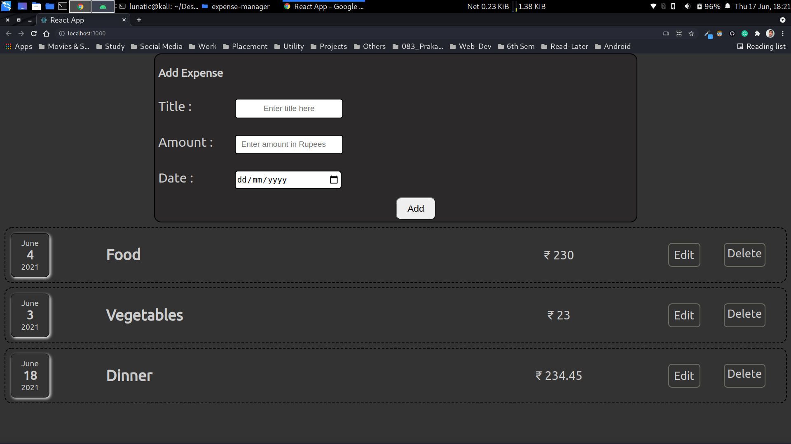
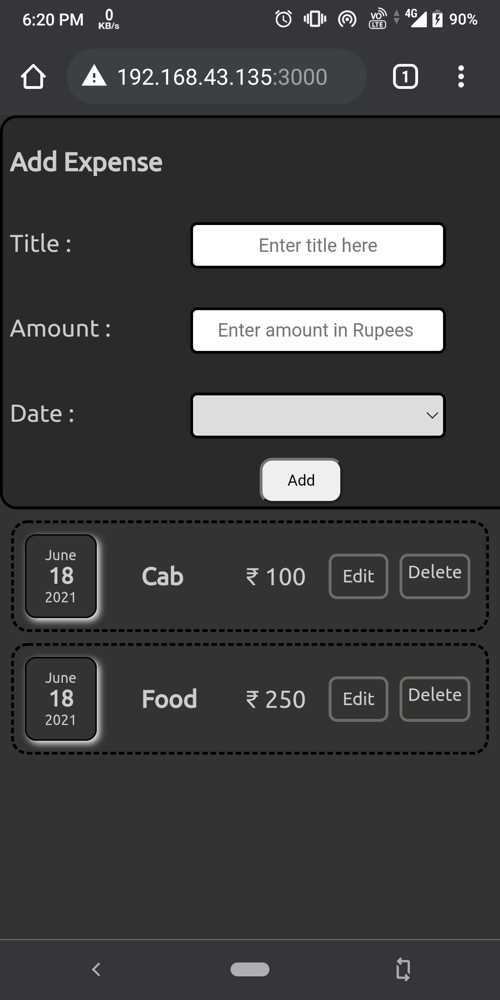

# Expense-Manager
A simple website build using HTML5, CSS3, JavaScript & React Library to store your daily expenses.

## Requirements :- 
- NodeJs
- NPM

## How to install Requirements :-

- NodeJS
```
https://nodejs.org/en/download/
```
For more detail check it out here :- <a href="https://www.freecodecamp.org/news/install-react-with-create-react-app/" target="_blank">Installing ReactJs</a>.
 
## Description & Features :-
- It allows you to store your expense records and view them whenever required.
- Your data will be saved onto the local storage, so even if you close the tab or browser your data won't get lost.
- Super simple and easy to use.

 ## Output :-
 
 On Laptop
  

On Smartphone
   
 
## Issues & Improvements :- 
- Firebase will be integrated soon for storing data, so that user can access the data from anywhere through internet.
- "Edit" functionality will replaced with dropdown selection menu to make it more convenient.
- A filter option which can filter out your expenses based on few conditions is on the way.
- UI is not that much good, might change it too.


 ## Dev :- Prakash Gupta
